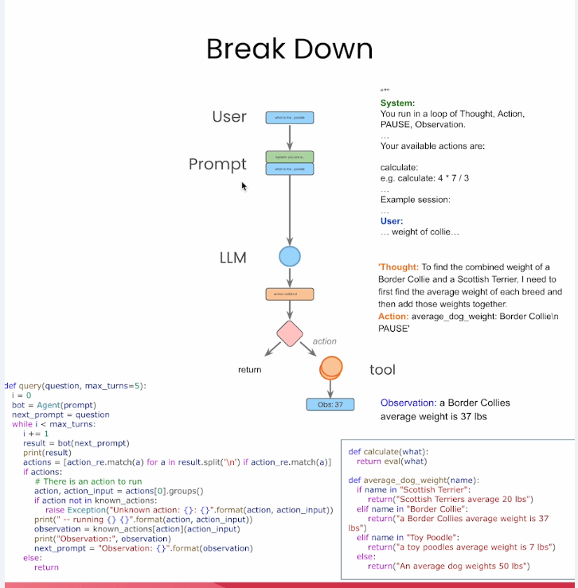
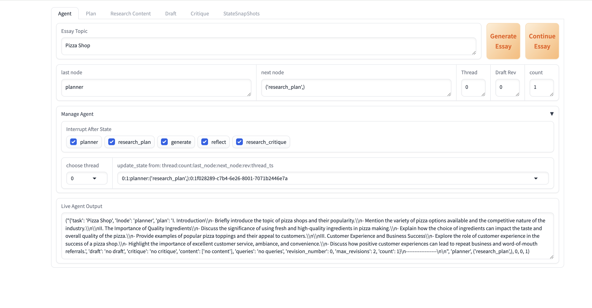

# LangGraph Exploration Notebooks 🚀

Welcome to this collection of Jupyter notebooks designed to explore the capabilities of **LangGraph**, a library for building stateful, multi-actor applications with LLMs. This project provides practical examples demonstrating core LangGraph concepts, from basic agent construction to more complex workflows involving persistence, streaming, and human-in-the-loop interactions.




---

## ✨ Key Concepts & Features Demonstrated

This project showcases various aspects of LangGraph, including:

*   **Agent Construction:** Building agents with tools (like Tavily Search) and custom logic.
*   **State Management:** Defining and updating agent state using `TypedDict`.
*   **Graph Building:** Defining nodes (functions, callables) and edges (including conditional edges).
*   **Persistence:** Saving and resuming graph state using Checkpointers (`SqliteSaver` / `AsyncSqliteSaver`).
*   **Streaming:**
    *   Streaming intermediate steps and outputs using `.stream()`.
    *   Asynchronous streaming with `.astream()` and `.astream_events()` for token-level output.
*   **Human-in-the-Loop:** Designing workflows that can pause for human input, review, or modification.
*   **Complex Workflows:** Implementing multi-step processes like planning, drafting, and critiquing (Essay Writer example).
*   **Tool Usage:** Integrating external tools (Tavily Search) within the graph.

---

## 📚 Notebooks Overview

1.  **`LangGraph_Components.ipynb`**:
    *   Introduces the fundamental building blocks of LangGraph.
    *   Covers defining state, adding nodes, setting entry/end points, and compiling the graph.
    *   Demonstrates a basic agent with a tool.
    *   Includes graph visualization.
    ```python:LangGraph_Components.ipynb
    startLine: 170
    endLine: 173
    ```
    

2.  **`Persistence_&_Streaming.ipynb`**:
    *   Focuses on saving the state of your graph runs using checkpointers (`SqliteSaver`/`AsyncSqliteSaver`).
    *   Shows how to configure threads for persistent runs.
    *   Demonstrates streaming intermediate results using `.stream()` / `.astream()`.
    *   Includes an example of streaming individual tokens using `.astream_events()`.
    ```python:Persistence_&_Streaming.ipynb
    startLine: 76
    endLine: 79
    ```
    ```python:Persistence_&_Streaming.ipynb
    startLine: 286
    endLine: 290
    ```
    ```python:Persistence_&_Streaming.ipynb
    startLine: 319
    endLine: 330
    ```

3.  **`Human_in_the_loop.ipynb`**:
    *   Explores how to incorporate human interaction into your LangGraph agents.
    *   Demonstrates interrupting graph execution to wait for user input.
    *   Shows how to modify the agent's state based on human feedback before resuming.
    *   Covers branching and state modification techniques.
    ```python:Human_in_the_loop.ipynb
    startLine: 100
    endLine: 104
    ```
4.  **`Essay_Writer.ipynb`**:
    *   Presents a more advanced example: an agent that iteratively plans, drafts, and critiques an essay.
    *   Showcases a multi-step process with conditional looping based on critique and revision limits.
    ```python:Essay_Writer.ipynb
    startLine: 52
    endLine: 60
    ```
    ```python:Essay_Writer.ipynb
    startLine: 444
    endLine: 451
    ```

---

## 🛠️ Setup & Installation

1.  **Clone the repository:**
    ```bash
    git clone <your-repo-url>
    cd <your-repo-directory>
    ```

2.  **Create and activate a virtual environment (recommended):**
    ```bash
    python -m venv lgenv
    source lgenv/bin/activate  # On Windows use `lgenv\Scripts\activate`
    ```

3.  **Install dependencies:**
    *   *Ensure you have a `requirements.txt` file listing all necessary packages.*
    ```bash
    pip install -r requirements.txt
    ```
    *(If you don't have one, create it by running `pip freeze > requirements.txt` after installing packages like `langgraph`, `langchain`, `langchain-openai`, `langchain-community`, `tavily-python`, `ipykernel`, `python-dotenv`, `jupyterlab`)*

4.  **Set up environment variables:**
    *   Create a `.env` file in the root directory.
    *   Add your API keys:
        ```dotenv
        OPENAI_API_KEY="your_openai_api_key"
        TAVILY_API_KEY="your_tavily_api_key"
        # LANGCHAIN_TRACING_V2="true" # Optional: for LangSmith tracing
        # LANGCHAIN_API_KEY="your_langsmith_api_key" # Optional: for LangSmith tracing
        ```

---

## ▶️ Usage

1.  **Activate the virtual environment:**
    ```bash
    source lgenv/bin/activate # Or `lgenv\Scripts\activate` on Windows
    ```

2.  **Start Jupyter Lab:**
    ```bash
    jupyter lab
    ```

3.  **Navigate to the notebooks** in the Jupyter Lab interface and run the cells sequentially.

4.  Ensure your `.env` file is correctly populated with the necessary API keys before running cells that interact with external services (OpenAI, Tavily).

---

## 💻 Technology Stack

*   **LangGraph:** Core library for building stateful agents.
*   **LangChain:** Supporting library for LLM interactions, message types, etc.
*   **OpenAI:** LLM provider (using models like `gpt-3.5-turbo`, `gpt-4o`).
*   **Tavily Search:** Tool for web search capabilities.
*   **Python 3.11+**
*   **Jupyter Notebook/Lab:** For interactive development and demonstration.
*   **SQLite:** Used by the checkpointer for persistence.

---

